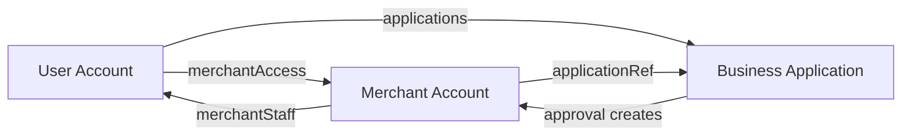

# Merchant Registration API Documentation

The Merchant Registration API provides a complete system for creating and managing merchant accounts, with automatic integration from approved business applications.

## Features

- ✅ **Automatic Merchant Creation**: When business applications are approved, merchant accounts are automatically created
- ✅ **Data Validation**: Comprehensive validation using utility functions
- ✅ **Staff Authentication**: Requires staff authentication for security
- ✅ **Duplicate Prevention**: Checks for existing phone numbers and emails
- ✅ **Wallet Integration**: Automatically creates blockchain wallets for merchants
- ✅ **Error Handling**: Detailed error responses with validation details
- ✅ **Type Safety**: Full TypeScript support with proper interfaces

## Endpoints

### 1. Create Merchant

**POST** `/api/commerce/register`

Create a new merchant account manually or via application approval.

#### Authentication Required
- Staff authentication token in `Authorization: Bearer <token>` header
- Any staff role can create merchants (Admin oversight recommended)

#### Request Body

```json
{
  "phoneNumber": "+1234567890",
  "email": "merchant@business.com",
  "merchantName": "Example Business",
  "merchantType": "RETAIL",
  "merchantAddress": "123 Main St, City, State, 12345, Country",
  "merchantLicense": "REG123456789",
  "merchantStaff": [
    {
      "name": "John Doe",
      "role": "MERCHANT_OWNER",
      "email": "john@business.com", 
      "phoneNumber": "+1234567890",
      "userId": "60d5f60f1234567890abcdef",
      "pushToken": []
    }
  ],
  "verificationStatus": "VERIFIED",
  "currentRegion": "north_america",
  "currentAddress": "123 Main St, City, State, 12345, Country",
  "notificationPreferences": {
    "paymentReceived": {
      "roles": "MERCHANT_OWNER",
      "sms": true,
      "push": true,
      "email": true
    }
  }
}
```

#### Required Fields
- `phoneNumber` - Unique phone number
- `email` - Unique email address
- `merchantName` - Business name
- `merchantType` - Must be one of the valid types (see below)
- `merchantAddress` - Full business address
- `merchantLicense` - Business registration/license number

#### Valid Merchant Types
```typescript
'RESTAURANT' | 'RETAIL' | 'MARKET' | 'SERVICE' | 'EDUCATIONAL' | 
'ENTERTAINMENT' | 'HOTEL' | 'RENTAL' | 'TRANSPORTATION' | 'OTHER'
```

#### Valid Staff Roles
```typescript
'ADMIN' | 'MERCHANT_OWNER' | 'MERCHANT_MANAGER' | 'MERCHANT_STAFF'
```

#### Response

**Success (201)**
```json
{
  "success": true,
  "message": "Merchant registered successfully",
  "data": {
    "merchantId": "60d5f60f1234567890merchant",
    "merchantName": "Example Business",
    "email": "merchant@business.com",
    "phoneNumber": "+1234567890",
    "verificationStatus": "VERIFIED",
    "wallet": {
      "address": "0x1234567890abcdef",
      "success": true
    }
  }
}
```

**Error (400) - Validation Failed**
```json
{
  "success": false,
  "error": "Validation failed",
  "details": [
    "phoneNumber is required",
    "Invalid email format"
  ]
}
```

**Error (409) - Duplicate**
```json
{
  "success": false,
  "error": "Merchant with this phone number already exists"
}
```

### 2. Get Merchant Metadata

**GET** `/api/commerce/register`

Retrieve available merchant types and other metadata for form validation.

#### Response

```json
{
  "success": true,
  "data": {
    "merchantTypes": [
      "RESTAURANT", "RETAIL", "MARKET", "SERVICE", 
      "EDUCATIONAL", "ENTERTAINMENT", "HOTEL", 
      "RENTAL", "TRANSPORTATION", "OTHER"
    ],
    "availableRoles": [
      "ADMIN", "MERCHANT_OWNER", "MERCHANT_MANAGER", "MERCHANT_STAFF"
    ],
    "verificationStatuses": [
      "PENDING", "VERIFIED", "REJECTED"
    ]
  }
}
```

## Automatic Merchant Creation

### From Business Applications

When a business application is **approved** via the Application API, a merchant account is automatically created using the application data.

#### Process Flow

1. **Staff approves business application**: `PATCH /api/commerce/apply`
   ```json
   {
     "applicationRef": "BIZ-1703123456789-ABC123",
     "status": "Approved",
     "reviewNotes": "All documents verified"
   }
   ```

2. **System automatically**:
   - Extracts business data from application
   - Maps fields to merchant format
   - Creates merchant account
   - Creates blockchain wallet
   - Adds merchant ID to application notes

3. **Data Mapping**:
   ```typescript
   // Application -> Merchant field mapping
   businessName -> merchantName
   businessCategory/Industry -> merchantType (intelligent mapping)
   businessStreetAddress + City + State + Zip + Country -> merchantAddress
   businessRegistrationNumber -> merchantLicense
   businessPhone -> phoneNumber
   businessEmail -> email
   authorizedSignatory -> merchantStaff[0].name
   applicantUserId -> merchantStaff[0].userId
   ```

#### Category to Merchant Type Mapping

The system intelligently maps business categories/industries to merchant types:

```typescript
// Examples of automatic mapping
"Restaurant" | "Food" -> "RESTAURANT"
"Retail" | "Shopping" -> "RETAIL" 
"Market" | "Marketplace" -> "MARKET"
"Service" | "Services" -> "SERVICE"
"Education" | "Educational" -> "EDUCATIONAL"
"Entertainment" -> "ENTERTAINMENT"
"Hotel" | "Hospitality" -> "HOTEL"
"Rental" | "Leasing" -> "RENTAL"
"Transport" | "Transportation" -> "TRANSPORTATION"
// Everything else -> "OTHER"
```

## Error Handling

### Validation Errors
- Missing required fields
- Invalid email/phone formats
- Invalid merchant type
- Invalid staff roles

### Database Errors
- Duplicate phone numbers
- Duplicate email addresses
- MongoDB validation failures
- Connection issues

### Wallet Creation
- Wallet creation failures don't prevent merchant creation
- Error logged and noted in merchant record
- Wallet can be created later via separate endpoint

## Integration Examples

### Frontend Form Validation

```typescript
// Get merchant types for dropdown
const response = await fetch('/api/commerce/register');
const { data } = await response.json();
const merchantTypes = data.merchantTypes;

// Validate before submission
const validateMerchant = (data) => {
  const errors = [];
  
  if (!data.phoneNumber) errors.push('Phone number required');
  if (!data.email || !/\S+@\S+\.\S+/.test(data.email)) {
    errors.push('Valid email required');
  }
  if (!merchantTypes.includes(data.merchantType)) {
    errors.push('Invalid merchant type');
  }
  
  return errors;
};
```

### Creating Merchant

```typescript
const createMerchant = async (merchantData) => {
  const token = localStorage.getItem('staff-token');
  
  const response = await fetch('/api/commerce/register', {
    method: 'POST',
    headers: {
      'Content-Type': 'application/json',
      'Authorization': `Bearer ${token}`
    },
    body: JSON.stringify(merchantData)
  });
  
  const result = await response.json();
  
  if (result.success) {
    console.log('Merchant created:', result.data.merchantId);
    console.log('Wallet address:', result.data.wallet.address);
  } else {
    console.error('Error:', result.error);
    if (result.details) {
      console.error('Validation errors:', result.details);
    }
  }
};
```

## Database Schema

### Merchant Document Structure

```typescript
interface IMerchant {
  _id: ObjectId;
  phoneNumber: string; // Unique
  email: string; // Unique
  merchantName: string;
  merchantType: 'RESTAURANT' | 'RETAIL' | /* ... */;
  merchantAddress: string;
  merchantLicense: string;
  merchantStaff: Array<{
    name: string;
    role: 'ADMIN' | 'MERCHANT_OWNER' | /* ... */;
    email: string;
    phoneNumber: string;
    userId: string;
    pushToken: string[];
  }>;
  verificationStatus: 'PENDING' | 'VERIFIED' | 'REJECTED';
  currentRegion: string;
  currentAddress: string;
  hasUnreadNotifications: boolean;
  notifications: IEmbeddedNotification[];
  advertisements?: IAdvertisement[];
  notificationPreferences: {
    paymentReceived: { roles: string; sms: boolean; push: boolean; email: boolean; };
    // ... other preferences
  };
  
  // Auto-creation metadata (when created from application)
  applicationRef?: string; // Reference to original application
  approvedBy?: ObjectId; // Staff member who approved
  approvedAt?: Date; // When approved
  createdBy?: ObjectId; // Staff member who created
  
  createdAt: Date;
  updatedAt: Date;
}
```

## Security & Authentication

### Staff Authentication Required
- All merchant creation requires valid staff authentication
- JWT tokens validated via `getAuthenticatedStaff()`
- No specific role restrictions (any staff can create merchants)

### Data Validation
- Server-side validation using `validateMerchantData()`
- TypeScript interfaces ensure type safety
- MongoDB schema validation as final check

### Duplicate Prevention
- Phone number uniqueness enforced
- Email address uniqueness enforced
- Case-insensitive regex matching for phone numbers

## Production Readiness

### ✅ Ready to Use Now
- Complete validation system
- Proper error handling
- Staff authentication integration
- Automatic wallet creation
- Database relationship management

### ✅ Automatic Integration
- Business application approval triggers merchant creation
- No manual intervention required
- Seamless data transfer from applications

### ✅ Monitoring & Logging
- Comprehensive console logging
- Error tracking for wallet creation
- Application reference tracking

## Next Steps

1. **Test the automatic flow**: Approve a business application and verify merchant creation
2. **Frontend integration**: Build admin interface for manual merchant creation
3. **Merchant dashboard**: Create merchant-facing portal using the merchant data
4. **Payment integration**: Connect merchants to payment processing systems
5. **Analytics**: Add merchant performance tracking and reporting 

## Owner Linking System

### How Owners are Connected to Merchants

When a business application is approved, the system creates a **two-way link** between the applicant user and the new merchant account:

#### 1. **Merchant Staff Link** (Merchant → User)
```typescript
// In merchant.merchantStaff array
{
  name: "John Doe",              // From authorizedSignatory
  role: "MERCHANT_OWNER",        // Highest privilege
  email: "john@business.com",    
  phoneNumber: "+1234567890",
  userId: "60d5f60f1234567890abcdef",  // 🔑 Links to User._id
  pushToken: []
}
```

#### 2. **User Merchant Access** (User → Merchant)
```typescript
// In user.merchantAccess array
{
  userRole: "MERCHANT_OWNER",
  merchantId: "60d5f60f1234567890merchant",  // 🔑 Links to Merchant._id
  merchantName: "Example Business"
}
```

### Access Patterns

#### **Finding User's Merchants** (Fast Lookup)
```typescript
import { getUserMerchants } from '@/utils/merchantUtils';

const result = await getUserMerchants(userId);
if (result.success) {
  result.merchants.forEach(merchant => {
    console.log(`${merchant.merchantName} - Role: ${merchant.userRole}`);
  });
}
```

#### **Checking Specific Access**
```typescript
import { checkUserMerchantAccess } from '@/utils/merchantUtils';

const access = await checkUserMerchantAccess(userId, merchantId);
if (access.hasAccess) {
  console.log(`User has ${access.role} access to merchant`);
}
```

#### **Finding Merchant's Staff**
```typescript
const merchant = await Merchant.findById(merchantId);
const owner = merchant.merchantStaff.find(staff => staff.role === 'MERCHANT_OWNER');
console.log(`Owner: ${owner.name} (User ID: ${owner.userId})`);
```

### Authentication Flow

#### **User Login → Merchant Access**
```typescript
// 1. User logs in with regular credentials
const user = await User.findById(userId);

// 2. Check if they have merchant access
const merchantAccess = user.merchantAccess || [];

// 3. User can switch to merchant mode
if (merchantAccess.length > 0) {
  // Show merchant dashboard options
  merchantAccess.forEach(access => {
    console.log(`Access to: ${access.merchantName} as ${access.userRole}`);
  });
}
```

#### **Merchant Dashboard Authentication**
```typescript
// Verify user can access specific merchant
const hasAccess = await checkUserMerchantAccess(userId, merchantId);
if (!hasAccess.hasAccess) {
  return NextResponse.json({ error: 'Unauthorized' }, { status: 403 });
}

// User can now perform merchant operations based on their role
const canManageStaff = hasAccess.role === 'MERCHANT_OWNER';
const canProcessPayments = ['MERCHANT_OWNER', 'MERCHANT_MANAGER'].includes(hasAccess.role);
```

### Staff Management

#### **Adding Additional Staff**
```typescript
import { addUserToMerchant } from '@/utils/merchantUtils';

// Add another user as staff
const result = await addUserToMerchant(
  newUserId,           // User to add
  merchantId,          // Merchant account
  'MERCHANT_MANAGER',  // Role to assign
  currentUserId        // Who is adding them
);
```

#### **Removing Staff**
```typescript
import { removeUserFromMerchant } from '@/utils/merchantUtils';

await removeUserFromMerchant(userId, merchantId, removedByUserId);
```

### Database Relationships



### Role Hierarchy

| Role | Permissions |
|------|-------------|
| **MERCHANT_OWNER** | Full access, manage staff, financial operations |
| **MERCHANT_MANAGER** | Operations, limited staff management |
| **MERCHANT_STAFF** | Basic operations, no management |
| **ADMIN** | System-level access (staff members) |

### API Endpoints for User-Merchant Management

#### **Get User's Merchants**
```typescript
// GET /api/user/merchants
const response = await fetch('/api/user/merchants', {
  headers: { 'Authorization': `Bearer ${userToken}` }
});
```

#### **Check Merchant Access**
```typescript
// GET /api/user/merchants/{merchantId}/access
const response = await fetch(`/api/user/merchants/${merchantId}/access`, {
  headers: { 'Authorization': `Bearer ${userToken}` }
});
```

### Security Considerations

1. **Token Validation**: User tokens must be validated for merchant operations
2. **Role Verification**: Check user's role before allowing specific actions
3. **Merchant Isolation**: Users can only access their assigned merchants
4. **Audit Trail**: All staff changes are logged with who made them

### Migration for Existing Data

If you have existing merchants without proper user links, run:

```typescript
// Migration script to link existing merchants to users
const merchants = await Merchant.find({});
for (const merchant of merchants) {
  const owner = merchant.merchantStaff.find(staff => staff.role === 'MERCHANT_OWNER');
  if (owner?.userId) {
    await User.findByIdAndUpdate(owner.userId, {
      $addToSet: {
        merchantAccess: {
          userRole: 'MERCHANT_OWNER',
          merchantId: merchant._id.toString(),
          merchantName: merchant.merchantName
        }
      }
    });
  }
}
``` 